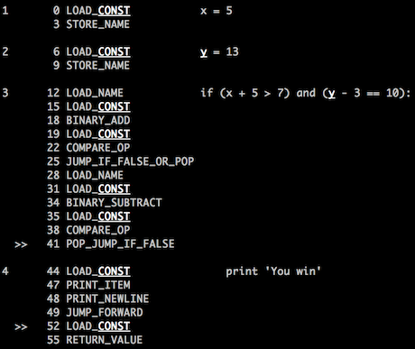
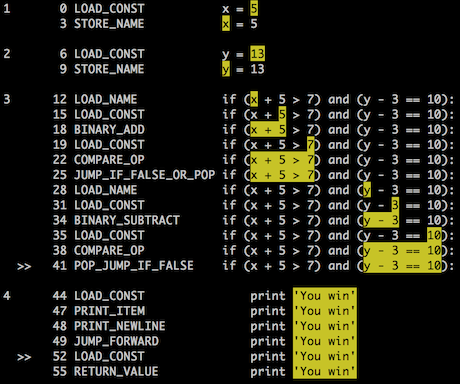

Py2crazy
========

Py2crazy is a modified version of the official Python interpreter
(CPython 2.7.5) that supports finer-grained tracing and debugging.

Py2crazy implements the following four features:

1. Each Python bytecode instruction maps to a range
of line and column numbers in the part of source code
that compiled into that instruction.

2. Debugger applications such as `bdb` call the trace function
at each executed bytecode rather than at each new executed line.

3. Peephole optimizations and opcode prediction macros
are disabled so that source code matches more closely with bytecode.
Doing so makes stepping through executed bytecodes appear
more intuitive to programmers, since steps aren't "magically" skipped.

4. The frame object exposes a new `f_valuestack` field, which is
a list containing the current values on the expression stack used
by the Python bytecode VM. This field allows debugging and tracing tools
to inspect intermediate results of expression evaluation.

### Why would anyone do this?

I created Py2crazy to support finer-grained expression-level tracing
in [Online Python Tutor](http://pythontutor.com). This [wiki
page](https://github.com/pgbovine/OnlinePythonTutor/blob/master/v3/docs/project-ideas.md#hack-cpython-to-enable-sub-expression-level-tracing)
discusses some of the design rationale. To illustrate,

- Online Python Tutor with Py2crazy provides fine-grained
<a href="http://pythontutor.com/visualize.html#code=def+foo()%3A%0A++return+True%0A%0Ax+%3D+3%0Ay+%3D+5%0A%0Aif+foo()+and+(x+%2B+y+%3E+7)%3A%0A++print+'YES'%0Aelse%3A%0A++print+'NO'&mode=display&cumulative=false&heapPrimitives=false&drawParentPointers=false&textReferences=false&showOnlyOutputs=false&py=2crazy&curInstr=0">expression-level stepping</a>,

- while regular Python provides only
<a href="http://pythontutor.com/visualize.html#code=def+foo()%3A%0A++return+True%0A%0Ax+%3D+3%0Ay+%3D+5%0A%0Aif+foo()+and+(x+%2B+y+%3E+7)%3A%0A++print+'YES'%0Aelse%3A%0A++print+'NO'&mode=display&cumulative=false&heapPrimitives=false&drawParentPointers=false&textReferences=false&showOnlyOutputs=false&py=2&curInstr=0">line-level stepping</a>
 (like in an ordinary debugger).

(For a more intricate example, here's recursive factorial visualized with
<a href="http://pythontutor.com/visualize.html#code=%23+dumb+recursive+factorial%0Adef+fact(n)%3A%0A++++if+(n+%3C%3D+1)%3A%0A++++++++return+1%0A++++else%3A%0A++++++++return+n+*+fact(n+-+1)%0A%0Aprint(fact(6))&mode=display&cumulative=false&heapPrimitives=false&drawParentPointers=false&textReferences=false&showOnlyOutputs=false&py=2&curInstr=0">regular Python</a>
and
<a href="http://pythontutor.com/visualize.html#code=%23+dumb+recursive+factorial%0Adef+fact(n)%3A%0A++++if+(n+%3C%3D+1)%3A%0A++++++++return+1%0A++++else%3A%0A++++++++return+n+*+fact(n+-+1)%0A%0Aprint(fact(6))&mode=display&cumulative=false&heapPrimitives=false&drawParentPointers=false&textReferences=false&showOnlyOutputs=false&py=2crazy&curInstr=0">Py2crazy</a>.)

### Precise line and column info in bytecodes

Here's an illustration of the first (and most significant) feature. If you compile this code

    x = 5
    y = 13
    if (x + 5 > 7) and (y - 3 == 10):
        print 'You win'

with regular Python 2.7.5 and disassemble it (`python -m dis`), you get roughly the following bytecode:

Note that each bytecode instruction maps to one line of source code.

In contrast, if you compile this code with Py2crazy and disassemble, you can see that each bytecode
maps not only to a line, but also to a precise range of columns within that line (highlighted in yellow):

This level of detail makes it possible to create much more fine-grained tracing and debugging tools,
such as expression-level stepping for Online Python Tutor.

### How do you view line and column number info?

Compile Py2crazy and then run the special
"Super Disassembler" module ([Python-2.7.5/Lib/super_dis.py](https://github.com/pgbovine/Py2crazy/blob/master/Python-2.7.5/Lib/super_dis.py))
on a Python source file:

    Py2crazy/Python-2.7.5/python -m super_dis test.py

Most terminals support colors, so you should be able to see the yellow highlights.

To programmatically access this data, `import super_dis` and hook into the proper functions from your code.

(Note that `super_dis.py` works only with Py2crazy, not with regular Python.)

### How does Py2crazy debugger stepping differ from regular Python stepping?

Normally, the debugger interface (`bdb`) registers a tracing function into the
regular CPython interpreter and steps through the target program roughly
one line at a time.

However, when run in Py2crazy, `bdb` steps one bytecode
instruction at a time, which provides much finer-grained tracing.

To see the difference, run `pdb` (the standard Python debugger built upon `bdb`)
on a test file in both regular Python

    python -m pdb test.py

and Py2crazy:

    Py2crazy/Python-2.7.5/python -m pdb test.py

### What did you change in CPython 2.7.5?

Check out the Git repo and run

    git diff d36dfc8ffaf5337adb96bd582e0733fe2ffe3f02

to see diffs against a fresh Python 2.7.5 source distribution.

Caveat: Although you might find some ideas in Py2crazy to be useful, its design
is ultimately driven by pedagogical goals, not by industrial-strength
debugging goals. For instance, run-time efficiency wasn't a concern.

### Footer

Created on 2013-07-03 by [Philip Guo](http://www.pgbovine.net/)
(philip@pgbovine.net)

Special thanks to [Ned Batchelder](http://nedbatchelder.com/) for inspiring this project,
and for providing technical guidance.

